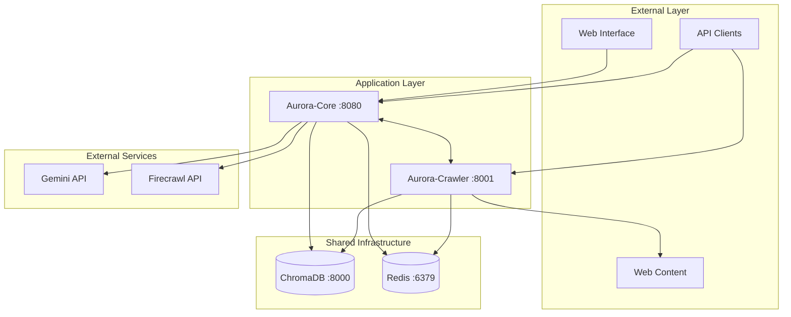
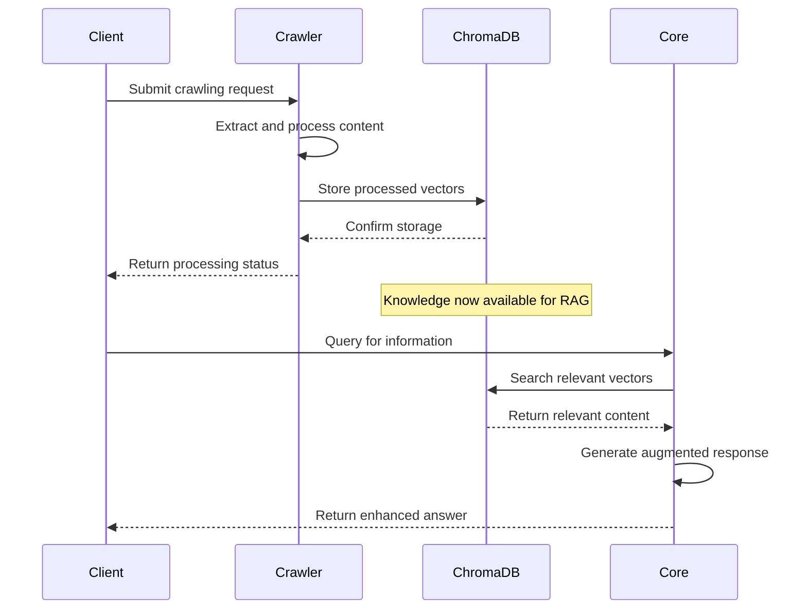
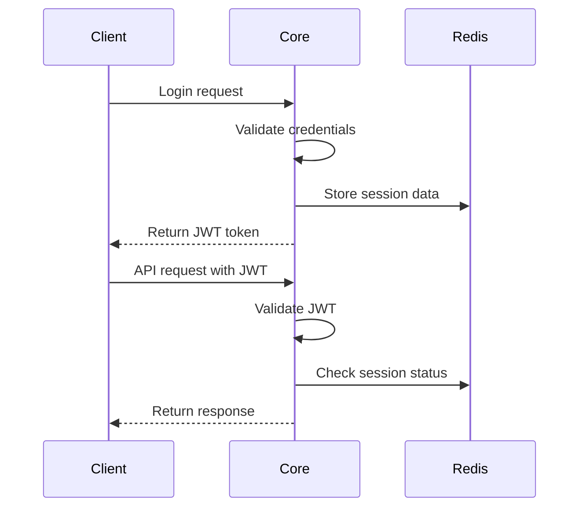

# Aurora-Plataform System Architecture 🏗️

This document provides a comprehensive overview of the Aurora-Plataform system architecture, detailing the interactions between services, data flow, and infrastructure components.

## 🎨 System Overview

Aurora-Plataform implements a microservices architecture with shared infrastructure, designed for scalability, maintainability, and efficient resource utilization.



## 🔧 Service Architecture

### Aurora-Core (Port 8080)
**Role**: AI Operating System Kernel

**Key Components**:
- **AuroraRouter**: Central orchestration and task routing
- **RAG Engine**: Knowledge retrieval and augmentation using ChromaDB
- **DeepDiveScraper**: Web content perception and extraction
- **Authentication System**: JWT-based security
- **API Gateway**: RESTful API endpoints

**Dependencies**:
- ChromaDB for vector storage and retrieval
- Redis for caching and session management
- External AI APIs (Gemini, Firecrawl)

### Aurora-Crawler (Port 8001)
**Role**: Advanced Web Crawling and Data Ingestion

**Key Components**:
- **Deep Crawler**: Playwright-based web crawling
- **Content Processor**: Document parsing and extraction
- **Audio Transcription**: Voice content processing
- **Batch Ingestion**: Large-scale data processing
- **Quality Assurance**: Content validation and filtering

**Dependencies**:
- ChromaDB for content storage
- Redis for job queuing and state management
- Playwright for browser automation

### Shared Infrastructure

#### ChromaDB (Port 8000)
**Purpose**: Vector Database for Knowledge Storage

**Configuration**:
- Fixed version 0.4.15 for stability
- NumPy compatibility fixes applied
- Health checks for reliability
- Persistent storage via Docker volumes

**Usage Patterns**:
- Aurora-Core: Knowledge retrieval for RAG operations
- Aurora-Crawler: Content storage after processing

#### Redis (Port 6379)
**Purpose**: Caching and Session Management

**Configuration**:
- Latest stable version
- Persistent data storage
- Health monitoring
- Connection pooling

**Usage Patterns**:
- Aurora-Core: Session storage, API rate limiting
- Aurora-Crawler: Job queues, processing state

## 🌐 Network Architecture

### Docker Network: `aurora-network`
All services communicate via a dedicated Docker bridge network:

```yaml
networks:
  aurora-network:
    driver: bridge
    name: aurora-network
```

### Service Discovery
Services use Docker's built-in DNS resolution:
- ChromaDB: `http://chromadb:8000`
- Redis: `redis://redis:6379`
- Inter-service communication: `http://aurora-core:8080`, `http://aurora-crawler:8001`

### Port Mapping
| Service | Internal Port | External Port | Purpose |
|---------|---------------|---------------|----------|
| Aurora-Core | 8080 | 8080 | Main API access |
| Aurora-Crawler | 8000 | 8001 | Crawler API access |
| ChromaDB | 8000 | 8000 | Direct database access |
| Redis | 6379 | 6379 | Cache access |

## 📊 Data Flow Architecture

### Knowledge Ingestion Flow


### Processing Pipeline
1. **Content Acquisition**: Aurora-Crawler fetches web content
2. **Content Processing**: Text extraction, cleaning, and chunking
3. **Vector Generation**: Convert content to embeddings
4. **Storage**: Store vectors in ChromaDB with metadata
5. **Retrieval**: Aurora-Core queries vectors for RAG operations
6. **Response Generation**: Combine retrieved knowledge with AI models

## 🔒 Security Architecture

### Authentication Flow


### Security Layers
1. **Network Isolation**: Docker network segmentation
2. **Authentication**: JWT tokens for API access
3. **Authorization**: Role-based access control
4. **Data Protection**: Environment-based secrets management
5. **Communication Security**: Internal service-to-service authentication

## 📈 Scalability Considerations

### Horizontal Scaling
- **Stateless Services**: Both Core and Crawler designed for multiple instances
- **Load Balancing**: External load balancer distributes requests
- **Shared State**: Redis maintains shared application state
- **Database Scaling**: ChromaDB supports clustering for large datasets

### Performance Optimization
- **Caching Strategy**: Multi-layer caching with Redis
- **Connection Pooling**: Efficient database connections
- **Async Processing**: Non-blocking I/O operations
- **Resource Monitoring**: Health checks and performance metrics

## 🔄 Development Architecture

### Local Development
```yaml
# Development overrides
aurora-core:
  volumes:
    - ./aurora-core:/app
    - /app/.venv  # Preserve dependencies

aurora-crawler:
  volumes:
    - ./aurora-crawler:/app
    - /app/.venv  # Preserve dependencies
```

### Testing Strategy
- **Unit Tests**: Service-specific test suites
- **Integration Tests**: Cross-service functionality
- **End-to-End Tests**: Complete workflow validation
- **Performance Tests**: Load and stress testing

## 🚀 Deployment Architecture

### Container Strategy
- **Multi-stage Builds**: Optimized production images
- **Health Checks**: Comprehensive service monitoring
- **Resource Limits**: CPU and memory constraints
- **Restart Policies**: Automatic failure recovery

### Infrastructure as Code
```yaml
# Production considerations
services:
  aurora-core:
    deploy:
      replicas: 3
      resources:
        limits:
          cpus: '2'
          memory: 2G
        reservations:
          memory: 1G
```

## 📊 Monitoring Architecture

### Health Monitoring
- **Service Health**: Docker health checks
- **Application Health**: Custom health endpoints
- **Infrastructure Health**: Resource utilization
- **External Dependencies**: Third-party service status

### Observability Stack
- **Logging**: Structured JSON logs
- **Metrics**: Prometheus-compatible metrics
- **Tracing**: Request tracing across services
- **Alerting**: Automated issue detection

## 🔮 Future Architecture Considerations

### Planned Enhancements
1. **Message Queue**: Add RabbitMQ/Kafka for async processing
2. **Service Mesh**: Implement Istio for advanced networking
3. **Monitoring Stack**: Add Prometheus + Grafana
4. **CDN Integration**: Content delivery optimization
5. **Multi-region Deployment**: Geographic distribution

### Scalability Roadmap
- **Database Sharding**: Partition data across multiple ChromaDB instances
- **Microservice Decomposition**: Split services into smaller components
- **Event-Driven Architecture**: Implement async communication patterns
- **Edge Computing**: Deploy services closer to users

---

*This architecture document reflects the current state and evolution plans for Aurora-Plataform. Updates should be made as the system grows and requirements change.*