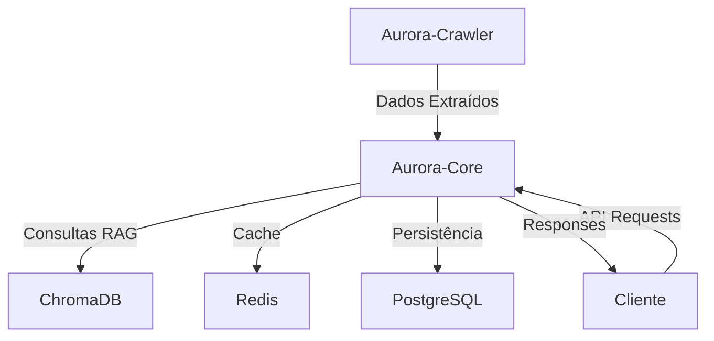

# Arquitetura Aurora-Plataform

## 🏛️ Visão Arquitetural

O Aurora-Plataform implementa uma arquitetura de **Sistema Operacional de IA (AIOS)** baseada em microserviços orquestrados, projetada para escalabilidade, manutenibilidade e eficiência operacional.

## 🧩 Componentes Arquiteturais

### 1. Aurora-Core (Kernel do AIOS)
```
aurora-core/
├── src/aurora_platform/
│   ├── main.py              # Ponto de entrada FastAPI
│   ├── core/                # Configurações centrais
│   ├── routers/             # Endpoints da API
│   ├── services/            # Lógica de negócio
│   ├── models/              # Modelos de dados
│   └── utils/               # Utilitários
├── alembic/                 # Migrações de banco
├── config/                  # Configurações
└── tests/                   # Testes automatizados
```

**Responsabilidades:**
- Orquestração central via AuroraRouter
- Gerenciamento de memória ativa (RAG)
- Autenticação e autorização
- APIs de negócio e integração

### 2. Aurora-Crawler (Sistema de Percepção)
```
aurora-crawler/
├── src/
│   ├── aurora_crawler/
│   │   ├── core/           # Motor de scraping
│   │   ├── extractors/     # Extratores específicos
│   │   ├── processors/     # Processamento de dados
│   │   └── storage/        # Persistência
│   └── scripts/            # Scripts de execução
├── outputs/                # Dados extraídos
└── tests/                  # Testes automatizados
```

**Responsabilidades:**
- Web scraping inteligente
- Extração de conteúdo estruturado
- Processamento de documentos
- Ingestão no sistema de conhecimento

## 🔗 Comunicação Entre Componentes

### Fluxo de Dados Principal:


### Protocolos de Comunicação:
- **HTTP/REST:** APIs públicas e internas
- **Database:** Conexões diretas via SQLModel/SQLAlchemy
- **Message Queue:** Redis para cache e filas
- **Vector DB:** ChromaDB para recuperação semântica

## 🏗️ Padrões Arquiteturais

### 1. Domain-Driven Design (DDD)
- Separação clara entre domínios
- Modelos ricos em comportamento
- Linguagem ubíqua entre equipes

### 2. Clean Architecture
```
Presentation Layer (FastAPI Routers)
    ↓
Application Layer (Services)
    ↓
Domain Layer (Models & Business Logic)
    ↓
Infrastructure Layer (Database, External APIs)
```

### 3. CQRS (Command Query Responsibility Segregation)
- Comandos: Operações de escrita otimizadas
- Queries: Operações de leitura otimizadas
- Separação de responsabilidades

## 🔧 Stack Tecnológico

### Backend (Aurora-Core)
- **Framework:** FastAPI 0.104+
- **Linguagem:** Python 3.11+
- **Database:** PostgreSQL 15+
- **ORM:** SQLModel + SQLAlchemy
- **Migrações:** Alembic
- **Cache:** Redis 7+
- **Vector DB:** ChromaDB
- **Auth:** JWT Tokens

### Crawler (Aurora-Crawler)
- **Linguagem:** Python 3.11+
- **Web Scraping:** Selenium + BeautifulSoup
- **Processing:** Pandas, NumPy
- **HTTP Client:** httpx, requests
- **Storage:** JSON, CSV, Database

### DevOps & Infrastructure
- **Containerization:** Docker + Docker Compose
- **Dependency Management:** Poetry
- **Code Quality:** Ruff, Black, MyPy
- **Testing:** pytest, coverage
- **Documentation:** MkDocs (futuro)

## 🚀 Deployment Architecture

### Desenvolvimento Local:
```yaml
services:
  aurora-core:      # Port 8080
  aurora-crawler:   # Port 8001
  postgresql:       # Port 5432
  redis:           # Port 6379
  chromadb:        # Port 8000
```

### Produção (Proposta):
```yaml
Load Balancer
    ↓
Multiple Aurora-Core Instances
    ↓
Shared Services:
  - PostgreSQL Cluster
  - Redis Cluster
  - ChromaDB Cluster
  - Aurora-Crawler Workers
```

## 🔒 Segurança

### Autenticação & Autorização:
- JWT Tokens com refresh capability
- Role-based access control (RBAC)
- API Key authentication para serviços

### Proteção de Dados:
- Criptografia de senhas (bcrypt)
- Sanitização de entrada
- Rate limiting
- CORS configurado

### Segurança de Container:
- Non-root users
- Multi-stage builds
- Secrets via environment variables
- Health checks implementados

## 📊 Observabilidade

### Logs:
- Structured logging (JSON)
- Centralized via Docker logging
- Different log levels per environment

### Monitoring:
- Health check endpoints
- Application metrics
- Database performance monitoring
- Error tracking e alertas

### Testing:
```
Unit Tests        →  Componentes individuais
Integration Tests →  Comunicação entre serviços  
E2E Tests        →  Fluxos completos de usuário
Performance Tests →  Carga e stress testing
```

## 🔄 CI/CD Pipeline (Proposta)

### Desenvolvimento:
1. Code Push → GitHub
2. Automated Tests → pytest
3. Code Quality → Ruff, MyPy
4. Security Scan → Safety, Bandit
5. Build → Docker Images
6. Deploy → Development Environment

### Produção:
1. Pull Request Review
2. Full Test Suite
3. Security Validation
4. Performance Testing
5. Staging Deployment
6. Production Deployment
7. Monitoring & Rollback Capability

## 📈 Escalabilidade

### Horizontal Scaling:
- Stateless Aurora-Core instances
- Load balancer distribution
- Database read replicas
- Cache clusters

### Vertical Scaling:
- Resource optimization
- Connection pooling
- Query optimization
- Memory management

### Future Considerations:
- Microservices decomposition
- Event-driven architecture
- Message queues (RabbitMQ/Kafka)
- Service mesh (Istio)

---

**Documento mantido pela equipe de Arquitetura Aurora AI**